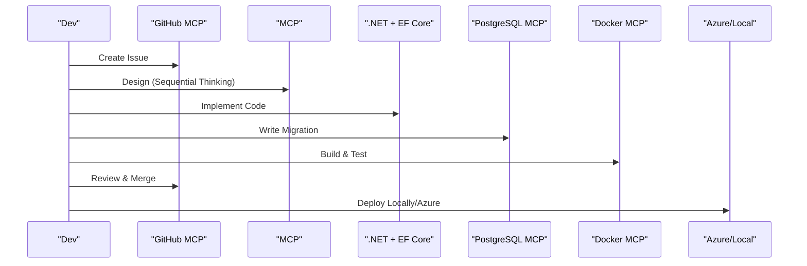

# Requirements Document - MCP TODO LAB

## Introduction

This plan balances fast MVP delivery with hands-on MCP server practice, clear sprint goals, and a path to a robust, production-grade TODO application.

## Scope

1. **Scope & Goals**

   - Build a backend-only TODO application using **.NET 9.0** with **Swagger** documentation.
   - Core features: CRUD (Create/Edit/Delete/Complete).
   - No user authentication in MVP; plan to add auth in advanced iterations.
   - Deliver a working demo within a **6‑hour sprint** using Docker locally (and later Azure).

2. **MCP Server Integration Focus**

   - **Sequential Thinking MCP Server** for structured problem-solving during design & implementation.
   - **GitHub MCP Server** for issue tracking, code reviews, and branch management.
   - **PostgreSQL MCP Server** to handle schema evolution, migrations, and query optimization.
   - **Docker MCP Server** (via GitHub actions) for container builds and local/Azure deployment.

3. **Constraints**
   - Simplify workflow to emphasize MCP interactions over feature complexity.
   - Single developer or small team operating under Scrum Master guidance.
   - All infrastructure and tool setup happens in-sprint; minimal external dependencies.

## Research Summary

| MCP Server                     | Tooling / Framework         | Rationale                                                                |
| ------------------------------ | --------------------------- | ------------------------------------------------------------------------ |
| Sequential Thinking MCP Server | Custom agent or script      | Guides developers through stepwise design checks, problem decomposition. |
| GitHub MCP Server              | GitHub Actions + Issues     | Centralizes PR workflow, CI build triggers, and release tagging.         |
| PostgreSQL MCP Server          | Flyway / EF Core Migrations | Automates schema versioning and rollback strategies.                     |
| Docker MCP Server              | Docker CLI + Docker Compose | Standardizes container builds and local orchestration.                   |
| Azure MCP Server (advanced)    | GitHub Actions + Azure CLI  | Enables CI/CD into Azure Web App / Container Instances.                  |

## Overall Architecture

### 1. Architecture model

A modular, layered backend service:

- **API Layer**: ASP.NET 9.0 Controllers (exposed via Swagger)
- **Service Layer**: Business logic, sequential-thinker validations
- **Data Layer**: EF Core with PostgreSQL migrations
- **Infrastructure Layer**: Docker images, configuration, and deployment scripts

**Integration Points**:

- **Sequential Thinking MCP**: Triggered during each pull request to review design checklist.
- **GitHub MCP**: Issues represent user stories; PR templates enforce MCP-driven checklists.
- **PostgreSQL MCP**: Migration scripts checked into repo; MCP server verifies migration quality.
- **Docker MCP**: GitHub Actions runs Docker builds and smoke tests locally.

### 2. Component Diagram

## Best Practices Checklist

- **Security**:

  - Sanitize inputs in API endpoints.
  - Store DB credentials via environment variables; consider Vault in advanced.

- **Logging & Monitoring**:

  - Standardized logs via Serilog (structured JSON).
  - Hook into Docker logs; plan Azure Monitor for future.

- **Maintainability**:

  - Clear layering (Controllers → Services → Repositories).
  - Document endpoints in Swagger.
  - Enforce code style via GitHub MCP pre‑commit hooks.

- **Scalability**:
  - Stateless API containers.
  - Plan DB connection pooling.
  - Container health checks for Azure deployment.

## Advanced Features

1. **Authentication & Authorization**

- Authetincate API requests
- Control access rights

2. **Azure Deployment & Performance Optimization**

   - GitHub Actions to deploy Docker image to Azure Container Instances.
   - ARM/Bicep templates, ACR, ACI or AKS deployment.
   - Enable Azure App Insights for telemetry.

3. **Monitoring & DevOps**

   - Environment variables/secrets for database connections be managed by MCP
   - Prometheus + Grafana for metrics; ELK stack for logs.
   - GitHub Actions CI/CD pipelines invoking Docker MCP + GitHub MCP.
   - Set up Azure Monitor and Alerts.
   - CI linting and security scans in pipeline.

4. **High Availability & Scaling**

   - Multi-zone PostgreSQL setup.
   - PostgreSQL Single-Server read replicas.
   - Kubernetes orchestration in AKS: API autoscaling in AKS with horizontal pod autoscaler.

5. **Advanced Analytics & Reporting**

   - Use MCP batch server to compute user engagement analytics.
   - Export reports via scheduled background jobs.
   - Build admin endpoints for audit logs.

6. **Performance Tuning**
   - Cache hot endpoints with Redis MCP server.
   - Profiling via dotTrace and query tuning in PostgreSQL.
